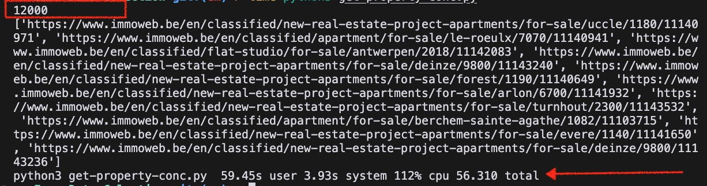

# 😱 First time coding in a team

## get-property-links()

I wrote the get-property-links() function.
It takes the base Immoweb URL for Belgian properties for sale and the number of search pages you want it to look at as input, and returns a list of individual property URLS as output.

- visits the input number of search pages
- scrapes their html content
- retrieves the individual URL of the property page
- saves that URL to a list variable
- saves the list as a CSV file
- returns the list to be used in the rest of the project code

## Runtime
Right now, it executes for 200 pages (12,000 unique URLs) in ~200 seconds.

Update - after editing the code to use ConcurrentFutures and ThreadPoolExecutor, it now executes for 200 search pages (12,000 unique URLs) in ~56 seconds.

## Special thanks!

To my team mates Gerrit, Karel and especially to Alice Mendes for her guidance & inspiration! 

