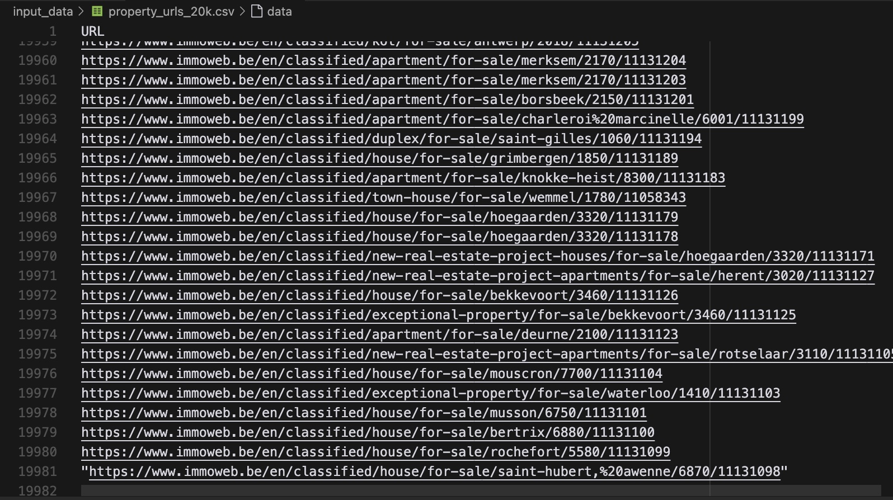
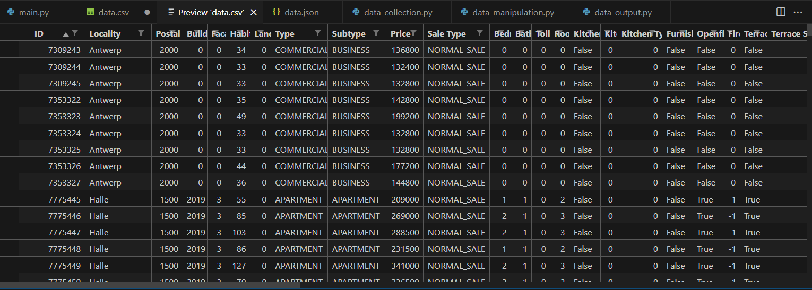

# Immo Eliza / Data Collection (MVP)

[](https://www.python.org/)

By team **Crawl Along**: 
[Karel](https://www.linkedin.com/in/karel-rodriguez-duran/), [Alice](https://www.linkedin.com/in/alice-edcm/), [Gerrit](https://www.linkedin.com/in/gerrit-geeraerts-143488141/), [Em](https://www.linkedin.com/in/mirunasuru/)

## 📖 Description
This program is designed to collect data on real estate properties across Belgium to aid in the development of a machine learning model for price prediction.

Features:

- Scrapes real estate listings from the largest Belgian real estate website
- Builds a dataset with detailed property information
- Saves data in both JSON and CSV formats for further analysis

## 🛠️ Setup & Installation

- create a new virtual environment by executing this command in your terminal:
`python3 -m venv wikipedia_scraper_env`
- activate the environment by executing this command in your terminal:
`source wikipedia_scraper_env/bin/activate`
- install the required dependencies by executing this command in your terminal:
`pip install -r requirements.txt`

## 👩‍💻 Usage
To run the program, clone this repo on your local machine, navigate to its directory in your terminal, make sure you have first executed your requirements.txt, then execute:

```
python3 main.py
```

## 🗂️ File Structure

```
.
├── src/scraper
│   ├── data_collection.py
│   ├── data_manipulation.py
│   └── data_output.py
│   └── property.py
│   └── utils.py
├── .gitignore
├── main.py
├── data.csv
├── data.json
└── README.md
```

## Program output

The program's output is a dataset containing information about approx 12,000 properties all over Belgium.

**Step 1**: a csv file with ~19,000 unique property urls



**Step 2**: a json file with 11,879 unique properties and 44 data points per property


**Step 3**: a csv file with data about 11,879 properties in Belgium - ⚠️ to be further processed



## 📂 Project background & timeline

This scraping project was done as part of the BeCode AI Bootcamp over the course of one week in February 2024. 
It is the first phase of a larger team project to build a machine learning model that predicts the price of real estate properties in Belgium.


## Thank you for visiting our project page!

We are team **Crawl Along**: [Karel](https://www.linkedin.com/in/karel-rodriguez-duran/), [Alice](https://www.linkedin.com/in/alice-edcm/), [Gerrit](https://www.linkedin.com/in/gerrit-geeraerts-143488141/), [Em](https://www.linkedin.com/in/mirunasuru/)


